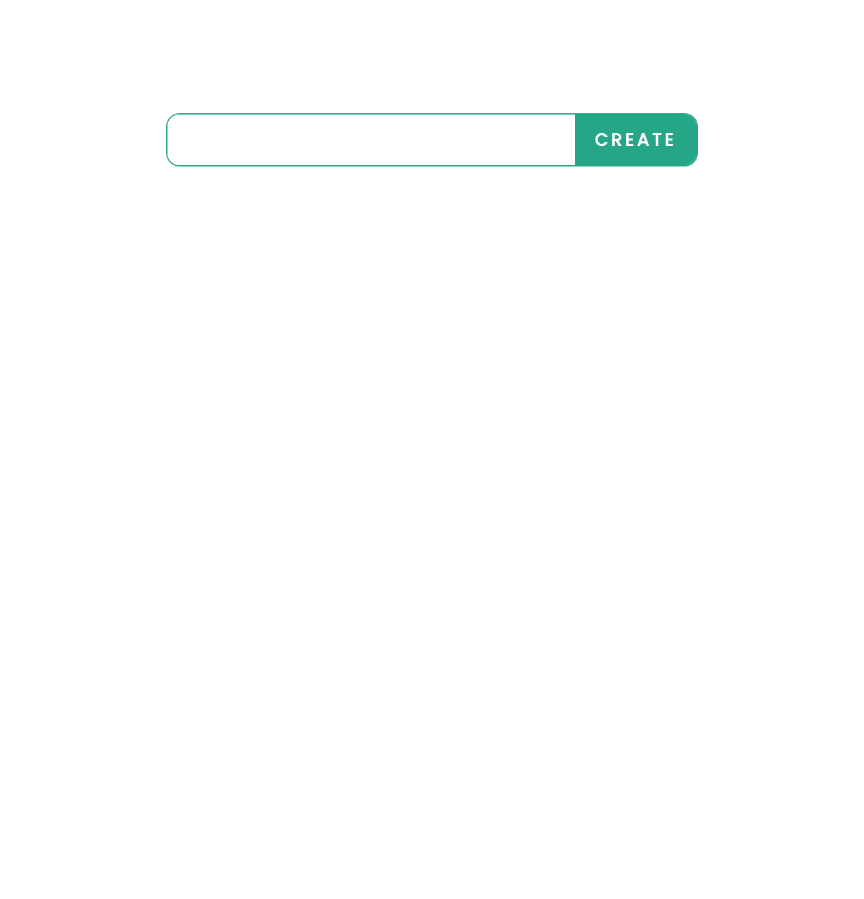
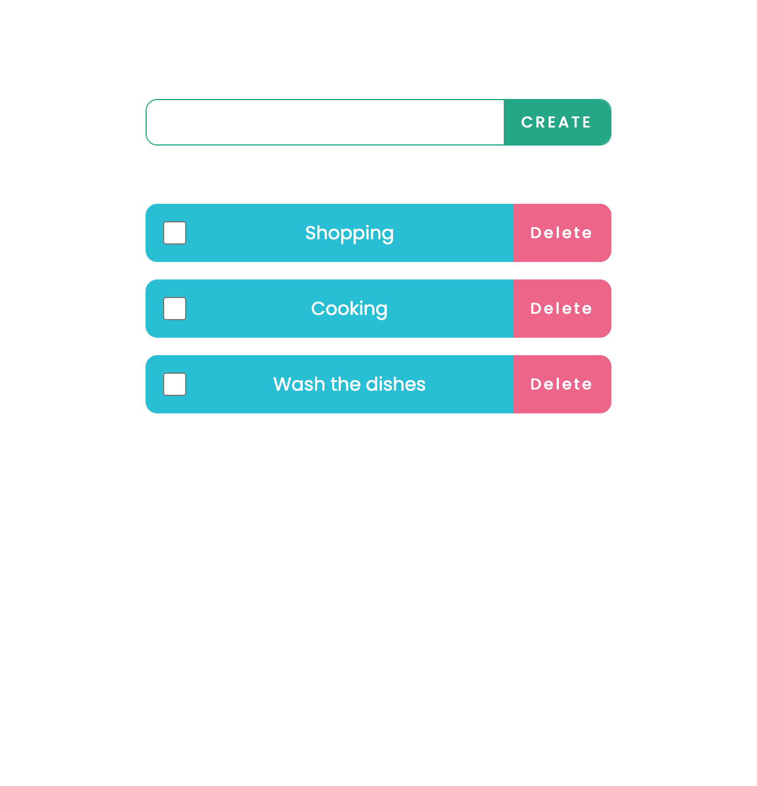
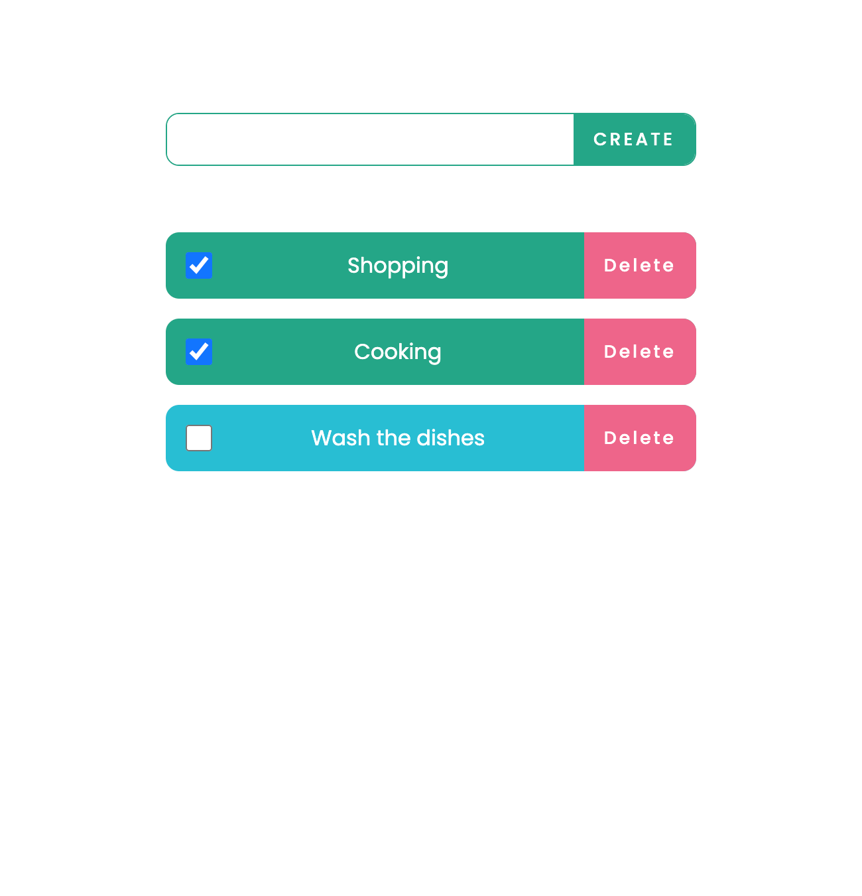

# TODO app

- Készíts egy tennivalók alkalmazást. Üresen az alkalmazás így nézzen ki (a stílust lemásolhatod, de készíthetsz egy saját design-t is):

    

- Ha beírsz az input-ba egy tennivalót, majd rákattintasz a CREATE gombra, a tennivaló hozzáadódik a tennivalók listájához

    
    

- A tennivaló szövegén kívül létrehozódik egy checkbox, illetve egy törlés gomb is. A checkbox jelzi, hogy a tennivaló elvégzése megtörtént, a törlés gombbal pedig az adott tennivalót tudjuk eltávolítani

    

## Tipp

- minden tennivaló létrehozásakor rendelj hozzá az eltárolt todo-hoz egy egyedi azonosítót (id-t) is, így könnyebb lesz a fejlesztés során beazonosítani az elemet (például törlésnél)

## Bónuszfeladat (haladó)
Milyen alkalmazás az, ahol ha lefrissíted a böngészőt az összes tennivalód eltűnik? 😉

- Tárold el a tennivalókat a böngésző [local storage-ében](https://developer.mozilla.org/en-US/docs/Web/API/Window/localStorage), és minden induláskor olvasd be onnan a már eltárolt tennivalókat. A local storage bővebb használatáról [itt](https://blog.logrocket.com/storing-retrieving-javascript-objects-localstorage/) olvashatsz
- Ha létrehozol egy új tennivalót, ezt is add hozzá a már eltároltakhoz, hogy ha frissítjük az oldalt, az újonnan létrehozott tennivalónk se vesszen el

